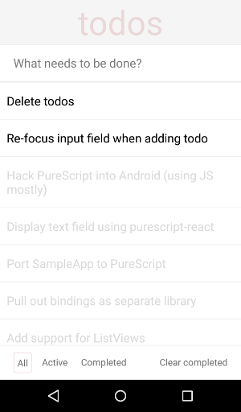

## PureScript on React Native - TodoMVC

This is a todo app for Android in the style of [TodoMVC](http://todomvc.com) using PureScript wrappers for React Native. It has only been tested on Android but may, in theory, work for iOS with small changes.



To install and run the app:

1. Install React Native and the Android SDK tools.
1. Install dependencies and set up project:

```
npm install
react-native android
bower update
```

1. Start Pulp to compile PureScript source (and recompile on changes):

  `./watch.sh`

1. Start server for serving JS files to the app.

  `react-native start`

1. Plug in Android device (or load up emulator).
1. Set up a reverse socket connection so your app grabs JavaScript sources from the correct place.

  `adb reverse tcp:8081 tcp:8081`

1. Build app and push it to the device. Enable auto-refresh in the app options.

  `react-native run-android`
